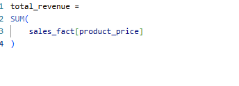
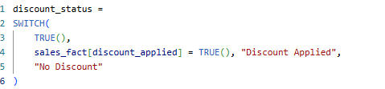
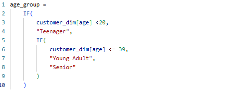
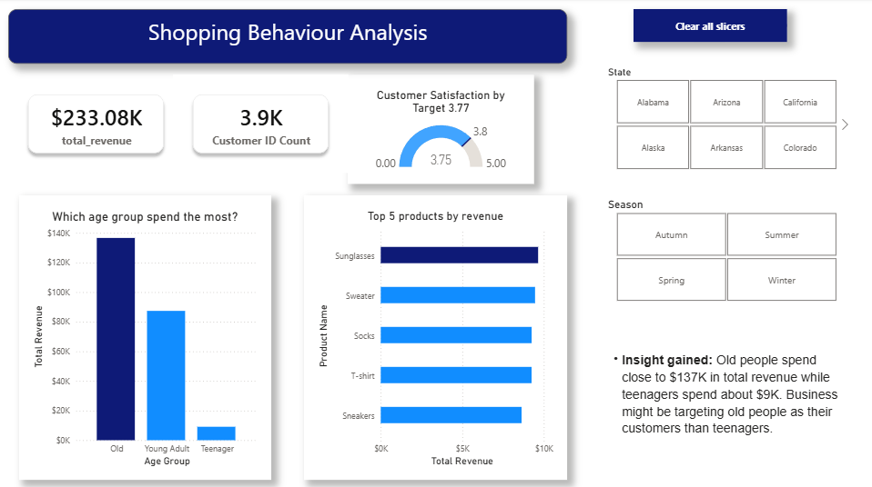
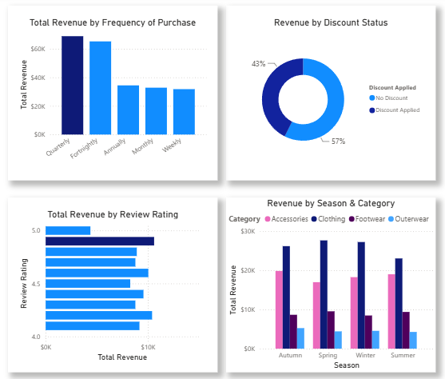

# Shopping Behaviour Analysis

## Project Overview

This project presents an interactive Power BI dashboard developed to analyse customer shopping behaviour, product performance and revenue trends within a retail business. The objective was to transform raw transactional data into actionable business insights that support marketing, inventory management and customer loyalty strategies. By combining data cleaning, dimensional modelling, DAX calculations and interactive visualisations, the dashboard enables decision-makers to identify high-value customers, evaluate discount effectiveness, understand seasonal purchasing trends and optimise product performance.  

- **Key Performance Indicator**

|KPI | Value
--- | ---
Total Revenue | $233.08K
Customers | 3 900
Average Rating | 3.75
Top Product | Sunglasses
Highest Spending Age Group | Old
Revenue Without Discounts | 57%
Best Category | Clothing

## Tools & Technologies
- Power BI 
- Power Query
- DAX
- Star Schema Data Modelling
- Data Transformation
- Interactive Dashboard Design
- KPI Development

## Data Cleaning Challenge & Solution

**Problem Identified**

During data modelling, duplicate customer records created a many-to-many relationship that multiplied fact table records from 3900 to 284 880. As a result, revenue KPIs increased from $233.08K to $17.02M, producing incorrect business results.

**Solution Applied in Power BI**  
I followed these two steps to clean my visualisation:
- I used Power Query > Remove Duplicates on customer_id to build a customer_dim table
- Created a proper 1-to-many relationship: customer_dim[customer_id] join with sales_fact[customer_id]  

## Data Modelling

**Key DAX Measures and Calculated Columns**

The dashboard uses DAX to create business metrics and calculated columns that improve reporting accuracy and support decision-making.

1. Total Revenue

- **Purpose:** To calculate the total revenue generated from all customer purchases.
- **Business Value:** Serves as the primary KPI used throughout the dashboard to evaluate overall business performance.

2. Discount Status (Calculated Column)

- **Purpose:** Creates a user-friendly category that identifies whether a transaction was made using promotional discounts.
- **Business Value:** Simplifies the comparison of discounted versus full price purchases, helping evaluate the effectiveness of promotional campaigns and pricing strategies.

3. Age Group (Calculated Column)

- **Purpose:** Creates customer age categories based on their age, making it easier to analyse purchasing behaviour across different demographic groups.
- **Business Value:** This calculated column enables customer segmentation by age group, allowing the business to identify which demographic contributes the most to revenue. These insights support targeted marketing campaigns, personalised promotions and product strategies tailored to different customer segments.

## The Analysis

- The purpose of this analysis is to showcase how I approached my project using Power BI tools and analysis questions. This report explains the analytical approach, tools used, key findings, business insights and recommendations. Furthermore, I answered these analysis questions to fulfill my analysis:

    - Which customer segment generates the highest revenue?
    - Which products contribute most to total sales?
    - How frequently do customers purchase?
    - How does customer satisfaction affect revenue?
    - Do discounts significantly influence purchasing behaviour?
    - Which product categories perform best across different seasons?
   

- **Analysis Performed**
    - **Data cleaning:** 
        - Checked for missing values and duplicates
        - Grouped continuous age variables into distinct categorical buckets for clean and high-level visualisation (for example, Senior, Young Adult or Teenager)
    - **Data Modelling & DAX:**
        - Developed an effective star schema model to handle filtering across dimensions
        - Key Measures Created
    - **Interactive dashboard:**
        - Executive overview page that focuses on macro KPIs, age distribution bar charts and top products ranking. Also, implemented multi-selected custom slicers and a centralised "Clear all slicers" button to maximise user experience and navigation ease.
        - Customer satisfaction deep dive page where I explored correlation patterns between frequency of purchase, discount impacts and product ratings.

### Power BI
**1. Overview**  

- [Access Live Visualisation Here](https://app.powerbi.com/reportEmbed?reportId=c7286f9e-7214-4706-9e2b-6134ab5fb678&autoAuth=true&ctid=acbcaed8-7adc-460c-ba57-028bdc80d84a)

 

This dashboard was created to turn sales data into clear, filterable insights for better marketing and inventory decisions. I used Power Query for data cleaning, DAX to create KPIs and star schema modelling to build relationships and support interactive slicers. This resulted in interactive dashboards that make it easier for the business to drill down into the relevant charts.

- The Key Performance Indicators (KPIs) make our visualisation easier to read and analyse. I have total revenue of $233.08K and Customer ID Count of 3.9K as part of my KPIs to easily pick how many customers were captured from shopping behaviour as part of their data collection and how they all managed to make total revenue. I further visualised using gauge chart to indicate customer satisfaction and if ever they met customer satisfaction target.

**Findings:**  

1. Age Group That Spends the Most

    - Customers at the senior age bucket generate the highest total revenue of $137K, likely driven by higher disposable income compared to teenagers with total revenue of $9K. While this ensures strong current revenue, the massive gap suggests an opportunity to develop targeted marketing campaigns for younger demographics to ensure long-term brand loyalty.

2. Products That Contribute High Revenue

    - This visualisation outlines the top 5 products that generate high revenue. It shows that accessories like sunglasses generate high revenue. The findings suggest that impulsive purchases contribute significantly to revenue. Placing high-performing products near checkout areas could increase sales.

**Insights gained**

- **Demographic Focus:** Customers aged 40+ generated approximately 59% of total revenue, making them the retailer’s most valuable customer segment. Teenagers contributed the smallest share of revenue, indicating that the current product offering or marketing strategy primarily appeals to older consumers.

    - **Recommendation:** Developed targeted market campaigns aimed at younger customers through social media promotions, student discounts and influencer partnerships while maintaining loyalty programmes for older customers.

- **Product Performance:** Sunglasses are the top-performing individual product by revenue of $10K, this indicates high seasonal or impulsive buying.

    - **Recommendation:** A strategic opportunity would be to consider stocking more of this product and improve marketing strategy to attract more customers.  

- **Customer Satisfaction:** The average customer rating of 3.75 narrowly missed the business target by 0.02 points, suggesting Customer satisfaction is generally positive but has room for improvement. Since ratings remained relatively stable across all seasons, Customer satisfaction appears to be influenced more by product quality and service consistency than seasonal factors.

    - **Recommendation:** Although customer satisfaction is close to the target, the business should continue monitoring customer feedback to identify recurring concerns and implement improvements in product quality and customer service. Raising the average rating above the current target can strengthen customer loyalty, encourage repeat purchases and improve long-term business performance

**2. Deep Analysis**  

 

1. How frequently do customers make purchases?

- **Insight:** Quarterly and Fortnightly buyers generate the highest revenue. Customers are likely to make purchases based on season change.

    - **Recommendation:** The business should strengthen customer loyalty by rewarding quarterly and fortnightly shoppers through personalised promotions, loyalty points or exclusive offers. In addition, targeted reminder campaigns can be used to encourage customers with lower purchase frequencies to shop more often, increasing repeat purchases and customer lifetime value.

2. How Customer Satisfaction Affects Revenue

- **Insight:** Relationship between variables shows that the lowest volume of revenue and the lowest volume of reviews were 5-star. Though the business had a total of $4K for 5-star, they had more 4.9 rating reviews in total of $11K.

    - **Recommendation:** The findings suggest that the current approach is effective. The business should continue maintaining product quality and service standards to sustain customer satisfaction and revenue.

3. Discount Applied vs Revenue

- **Insight:** More than half of total revenue (57%) was generated without promotional discounts, indicating that customers are willing to purchase at full price. This suggests strong product demand and provides an opportunity to reduce unnecessary discounts, helping improve profit margins.

    - **Recommendation:** Since most revenue is generated without discounts, the business should avoid excessive promotional campaigns that could reduce profit margins. Instead, discounts should be strategically targeted at slow-moving products, seasonal inventory, or customer segments that require additional purchase incentives.

4. Category that Generates the Highest Revenue by Season

- **Insight:** Clothing consistently dominates high revenue across all seasons, peaking at $28K in Spring. Outwear naturally drops in Spring and peaks in Autumn, confirming that stock levels closely mirror seasonal demand changes.

    - **Recommendation:** The business should align inventory planning with seasonal demand by increasing stock level for high-performing product categories before peak season while reducing inventory for products with lower seasonal demand. This approach can improve product availability, reduce excess stock and maximise revenue opportunities throughout the year.

## Conclusion

The Shopping Behaviour Analysis successfully transformed raw retail transaction data into meaningful business insights through tools and technologies that were used.  

From all the findings and insights, the business can strengthen its performance by developing targeted marketing campaigns for younger customer segments, aligning inventory levels with seasonal demand, using discounts more strategically and continuing to monitor customer feedback to improve customer satisfaction and encourage repeat purchases.

Overall, this project demonstrates how Power BI can be used to transform transactional data into actionable business intelligence. By combining effective data modelling, DAX and interactive visualisation, the dashboard provides stakeholders with a reliable tool for monitoring performance, identifying growth opportunities and supporting data-driven strategic decisions.

